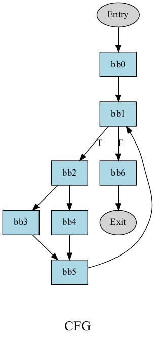
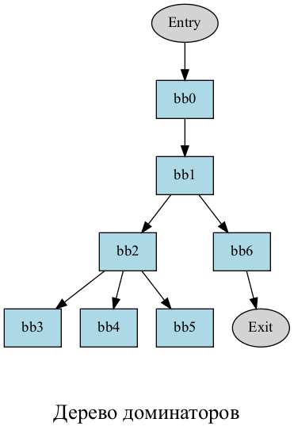
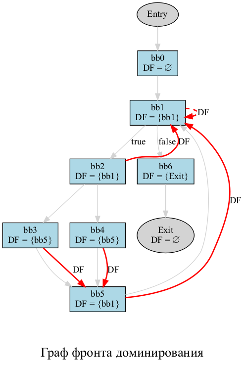
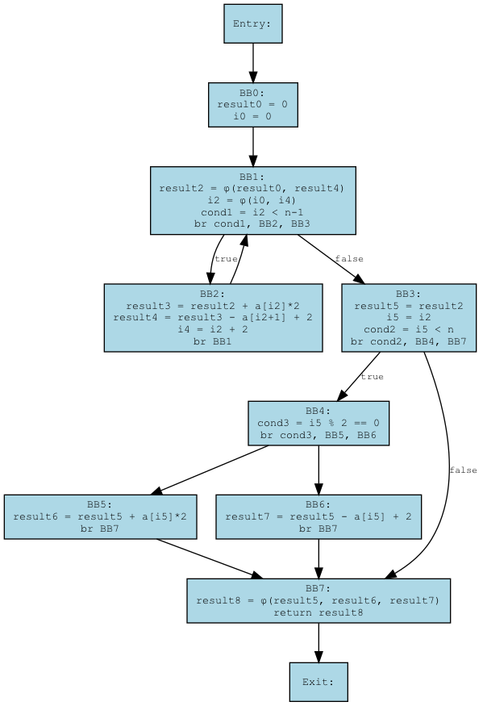

# Intermediate Representation

## Описание функции function2 :

### Функция function2 проходит по массиву целых чисел n и вычисляет результат по следующему правилу :

#### 1) На четных позициях: result += 2 * a[i] ;
#### 2) На нечетных позициях: result -= a[i] + 2 ;
#### В конце возвращается итоговое значение result.

## Граф потока управления (control flow graph) CFG :

---

## **Дерево** доминаторов для графа – ориентированное дерево, у которого ребра соответствуют отношениям непосредственного доминирования в графе.

---

##  Непосредственные доминаторы (Immediate Dominators) :

$$IDom(Entry) = null$$

$$IDom(bb0) = Entry$$

$$IDom(bb1) = bb0$$

$$IDom(bb2) = bb1$$

$$IDom(bb3) = bb2$$

$$IDom(bb4) = bb2$$

$$IDom(bb5) = bb2$$

$$IDom(bb6) = bb1$$

$$IDom(Exit) = bb6$$

# Дерево доминаторов :

## Граф фронта доминирования для графа G – это граф, в котором вершины совпадают с вершинами G, а направленное ребро от A к B означает, что B входит во фронт доминирования A.

$$DF(bb1) = bb1$$

$$DF(bb2) = bb1$$

$$DF(bb3) = bb5$$

$$DF(bb4) = bb5$$

$$DF(bb5) = bb1$$

# Граф фронта доминирования :

 

## Построение SSA: минимизация phi функций

### Используя фронт доминирования, мы можем построить алгоритм с минимальным количевтом phi функций. 

## Алгоритм :
### 1. Для каждой переменной, которая определена в нескольких базовых блоках, обходим все базовые блоки, в которых она определена. Помещаем их на стек.
### 2. Снимаем со стека базовый блок. Обходим его фронт доминирования, вставляя phi функции и добавляя эти базовые блоки в стек.
### 3. Повторяем операцию, пока стек не окажется пустым.

# Промежуточное представление Generic IR в SSA форме для данной функции.

 
# Оптимизация функции function2 : 

## 1) Constant propagation x * y = 2 * 1 = 2.
## 2) Loop Unrolling

## Cокращаем количество условных переходов. 
## Промежуточное представление Generic IR в SSA форме для оптимизированной функции (Unroll_func2) : 

